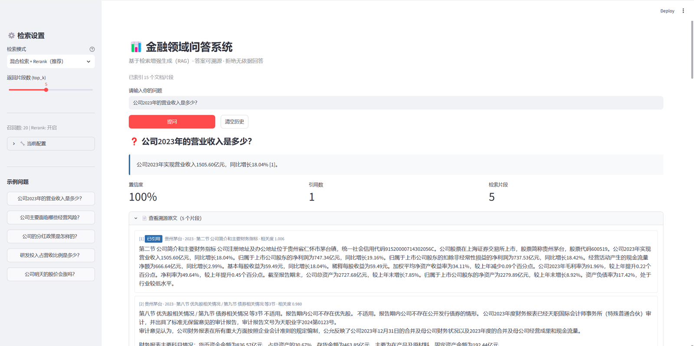
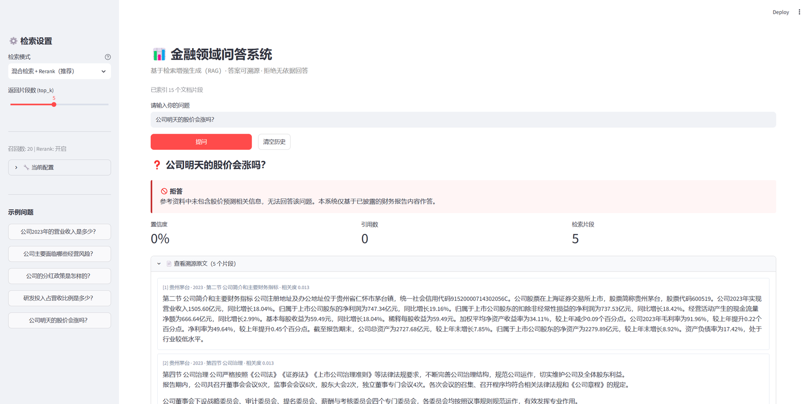
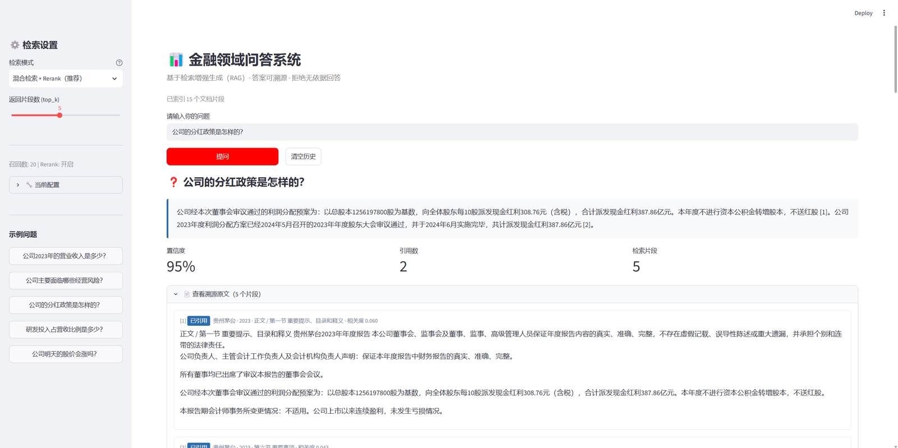
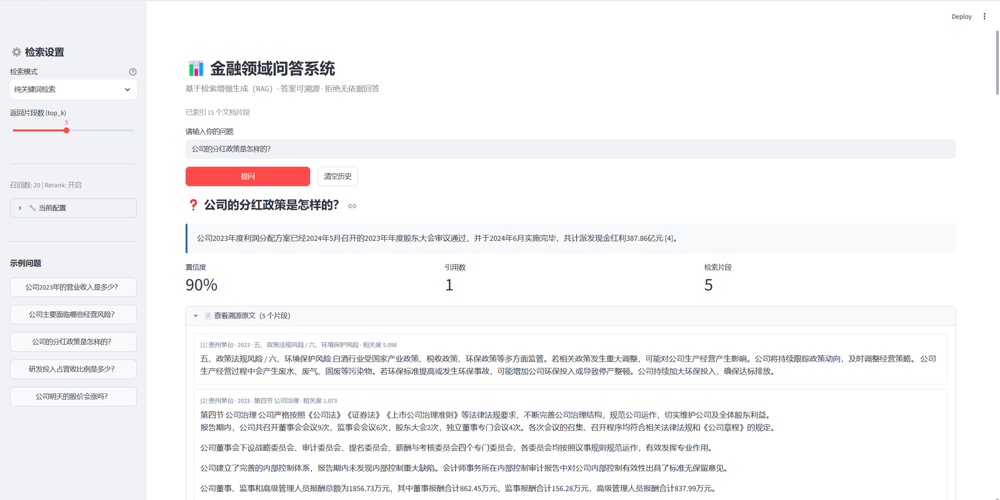

<div align="center">

# 金融领域问答系统

**基于检索增强生成（RAG）的可溯源金融问答系统**

针对上市公司定期报告，提供带原文引用的可信问答，对无依据的问题主动拒答

[](https://www.python.org/)
[](https://pytorch.org/)
[](LICENSE)

[技术原理](#技术原理) · [快速开始](#快速开始) · [实验结果](#实验结果) · [设计决策](#关键设计决策)

</div>

---

## 效果演示

### 事实型问答：精确数字 + 原文溯源

<div align="center">

</div>

问「公司2023年的营业收入是多少」，系统给出 `1505.60亿元` 并标注引用 `[1]`，
下方展示对应原文片段与相关度分数。**数字与年报完全一致，可逐句核查。**

### 拒答机制：金融场景的安全底线

<div align="center">

</div>

问「公司明天的股价会涨吗」，系统**主动拒答**而非凭先验知识作答。
在金融场景中，无法溯源的答案与错误答案同样危险——拒答机制的可靠性
比准确率更重要。

### 多源整合：跨片段回答

<div align="center">

</div>

问「公司的分红政策是怎样的」，系统引用 `[1][2]` 两条来源，
整合分红预案与实施进度。**答案包含"每10股派发308.76元"等细节，未遗漏关键信息。**

### 对比实验：纯关键词检索的失效

<div align="center">

</div>

同为「分红政策」问题，切换至**纯关键词检索**后：检索片段 [1] 变成无关的
「政策法规风险」，答案丢失了分红细则。原因是财报原文使用「利润分配」
「现金红利」等表述，与查询词「分红」字面不匹配。

**这正是本项目采用混合检索的实证依据** —— 见[关键设计决策](#关键设计决策)。

---

## 核心特性

| 特性 | 说明 |
|---|---|
| **混合检索** | BM25 关键词召回 + 向量语义召回，经 RRF 融合，兼顾事实型与语义型查询 |
| **Cross-Encoder 重排** | bge-reranker 对 (query, passage) 成对打分，显著提升 top-5 命中率 |
| **语义分块** | 按财报章节结构切分，章节标题前置增强检索信号 |
| **强制引用** | 每个事实性陈述标注来源编号，答案逐句可溯源 |
| **拒答机制** | 引用越界、无引用支撑、检索为空时主动拒答 |
| **可视化溯源** | Web 界面展示答案对应的原文片段与相关度 |

---

## 技术原理

### 为什么需要 RAG

大模型用于金融问答有三个根本障碍：

1. **无法访问私有数据** —— 上市公司年报不在预训练语料中
2. **知识有截止时间** —— 无法回答训练后的新披露信息
3. **幻觉风险** —— 金融场景中一个错误数字可能导致错误决策

RAG（Retrieval-Augmented Generation，[Lewis et al., 2020](https://arxiv.org/abs/2005.11401)）
的思路是：**生成前先从外部知识库检索相关资料，作为上下文喂给模型**，
把「参数化记忆」与「非参数化记忆」结合。

本项目的验证结果：无 RAG 时事实型问题准确率 **0%**，接入 RAG 后达 **100%**。

### 完整数据流

```
用户提问
   │
   ├─► ① 混合召回
   │      ├─ BM25 关键词检索 ──► top-20
   │      └─ BGE-M3 向量检索 ──► top-20
   │
   ├─► ② RRF 融合 ──► 合并为 top-20
   │      score(d) = Σ 1/(k + rank_i(d)),  k=60
   │
   ├─► ③ Reranker 重排 ──► top-5
   │      cross-encoder 对 (query, passage) 成对打分
   │
   ├─► ④ 上下文注入
   │      片段编号后拼入 Prompt 模板
   │
   ├─► ⑤ LLM 生成
   │      强制输出 JSON：{answer, citations, confidence, refused}
   │
   └─► ⑥ 引用校验
          编号越界 或 无引用支撑 → 强制拒答
```

### 六个关键环节

**① 语义分块**

固定长度分块会把不同主题的内容混入同一片段——极端情况是"营收数据"
与"风险提示"被切进同一个 chunk，检索时答案串台。

财报有明确的章节层级（如"第三节 管理层讨论与分析"），据此切分能保持
语义完整。额外优化：**把章节标题前置到片段正文中**，让嵌入模型感知
内容的章节归属。对过短章节采用合并策略，避免丢弃含关键信息的短节
（如分红预案）。

**② 双路召回**

- **BM25** —— 经典概率检索模型（[Robertson & Zaragoza, 2009](https://doi.org/10.1561/1500000019)），
  精确匹配财务术语与数字。中文需先经 jieba 分词。
- **向量检索** —— 通过 BGE-M3（[Chen et al., 2024](https://arxiv.org/abs/2402.03216)）
  把文本编码为 1024 维稠密向量，语义相近者距离更近。

**③ RRF 融合**

RRF（Reciprocal Rank Fusion，[Cormack et al., SIGIR 2009](https://dl.acm.org/doi/10.1145/1571941.1572114)）
的公式极其简洁：

```
score(d) = Σ 1 / (k + rank_i(d))
```

关键是**只使用排名、不使用原始分数** —— BM25 分数可能是 0-30，余弦
相似度是 0-1，量纲完全不同。RRF 天然规避了这个问题，且无需调参。

**④ Cross-Encoder 重排**

Bi-Encoder（双塔）将 query 与 document 分别编码，可预计算文档向量，
快但精度有限。Cross-Encoder 把两者拼接后送入模型，在注意力层充分交互，
精度高但无法预计算。

本项目实测对比（查询"营业收入是多少"）：

| 文档片段 | 嵌入模型得分 | 重排模型得分 |
|---|---|---|
| 营业收入段落 | 0.834 | **0.997** |
| 净利润段落 | 0.618 | **0.038** |
| **区分度** | 0.216 | **0.959** |

重排把区分度提升 **4.4 倍** —— 嵌入模型对"营业收入"与"净利润"这类
同域财务指标区分力不足，这正是需要重排的原因。

**⑤ 提示词约束**

系统提示明确要求：只依据参考资料作答、每个事实性陈述标注来源编号、
无依据时必须拒答。配合 Few-shot 示例规范输出格式。输出强制为 JSON，
便于服务端做结构化校验。

**⑥ 引用校验**

生成后的服务端检查：

- 答案中出现越界编号（如只有 5 个片段却引用 `[7]`）→ 拒答
- 答案有实质内容但无任何引用支撑 → 拒答
- 检索结果为空 → 直接拒答

这一机制把可信度从**"依赖模型自觉"**变为**"服务端可验证"**。

---

## 快速开始

### 环境要求

| 配置 | 启动时间 | 单次问答检索 | 体验 |
|---|---|---|---|
| GPU 6GB+ | 约 11 秒 | 0.4 秒 | 流畅 |
| CPU 8 核 | 约 10 秒 | 2.7 秒 | 可用 |
| CPU 低压 U | 约 20 秒 | 5-8 秒 | 较慢 |

- **Python 3.10+**（必需）
- **内存 3GB+**（实测峰值 2.2GB）
- **磁盘 6GB+**（模型约 4.3GB）
- **GPU 非必需**，CPU 也能完整运行

> **低配机器建议**：在 `.env` 中设置 `ENABLE_RERANK=0`，
> 单次检索可从 2.7 秒降至 0.5 秒，准确率从 100% 降至 96%。
> 重排模型占检索耗时的 94%，是性价比最高的取舍点。

### 一条命令完成安装

```bash
git clone https://github.com/tt1bt/financial-qa-system.git
cd financial-qa-system
python setup.py
```

`setup.py` 自动完成五步：环境检查 → 依赖安装 → 模型下载（ModelScope
国内源，支持断点续传）→ 生成 `.env` → 配置校验。

若模型已在其他位置，脚本会自动识别，不会重复下载 4.3GB。

装完后编辑 `.env` 填入 API Key，再启动：

```bash
streamlit run app/streamlit_app.py
```

### 分步执行（可选）

```bash
python setup.py --check          # 只检查环境，不做任何安装
python setup.py --skip-models    # 先跳过模型下载
python -m src.pipeline config    # 检查配置详情
```

### 配置 API Key

支持**任意 OpenAI 兼容接口**：

| 服务商 | Base URL | 推荐模型 | 获取 Key |
|---|---|---|---|
| DeepSeek | `https://api.deepseek.com/v1` | `deepseek-chat` | [platform.deepseek.com](https://platform.deepseek.com/) |
| 阿里通义 | `https://dashscope.aliyuncs.com/compatible-mode/v1` | `qwen-plus` | [dashscope.console.aliyun.com](https://dashscope.console.aliyun.com/) |
| 智谱 GLM | `https://open.bigmodel.cn/api/paas/v4` | `glm-4-flash` | [open.bigmodel.cn](https://open.bigmodel.cn/) |
| 月之暗面 | `https://api.moonshot.cn/v1` | `moonshot-v1-8k` | [platform.moonshot.cn](https://platform.moonshot.cn/) |
| 本地 Ollama | `http://127.0.0.1:11434/v1` | `qwen2.5:7b` | 无需 Key |

---

## 关键设计决策

以下五个决策是本项目的技术核心，每个都有实测数据支撑。

### D1 · 混合检索而非纯向量

金融问题分两类：语义型（"经营风险如何"）与事实型（"2023Q3 毛利率"）。

实测显示：**事实型问题上纯向量 Recall@1 仅 67%，BM25 达 83%**；
语义型问题则相反（向量 90% vs BM25 80%）。两者存在明确的互补关系。

根因：通用嵌入模型对同域财务指标区分力不足——"营业收入"与"净利润"
在向量空间中距离很近。

### D2 · RRF 之后必须加重排

RRF 只融合"排序意见"，不理解 query 与 passage 的语义交互。
Cross-Encoder 直接对二者打分，实测将区分度从 0.216 提升到 0.959。

计算开销极低：对 20 个候选打分约 0.07 秒（GPU），性价比极高。

### D3 · 强制引用是金融场景的生命线

无法溯源的答案与错误答案同样危险。系统要求逐句标注来源编号，
并在服务端校验——这一机制把可信度从"依赖模型自觉"变为"服务端可验证"。

### D4 · 按章节分块而非固定长度

固定长度会把"营收数据"与"风险提示"切进同一片段导致串台。
按财报章节层级切分能保持语义完整，并将章节标题前置增强检索信号。

### D5 · 数据源优先 HTML 而非 PDF

PDF 解析有三大坑：表格错乱、双栏串行、扫描件无文本层。
财经门户提供财报文本页，直接抓 HTML 可跳过整个解析难题。

---

## 项目结构

```
financial-qa-system/
├── setup.py                一键安装脚本
├── src/
│   ├── config.py           配置管理 + 模型路径三级查找
│   ├── schema.py           数据结构（Chunk / Answer）—— 模块间契约
│   ├── parser.py           文档解析（HTML / PDF / TXT）
│   ├── chunker.py          语义分块 + 短章节合并
│   ├── retrieval.py        混合召回 + RRF + Rerank ★核心
│   ├── generator.py        提示词构建 + LLM 调用 + 引用校验 ★核心
│   ├── pipeline.py         端到端编排与命令行入口
│   ├── evaluate.py         测试集评测
│   ├── ablation.py         消融实验
│   └── collect.py          数据采集
├── app/
│   └── streamlit_app.py    Web 界面
├── tools/
│   ├── download_models.py  模型下载
│   ├── gen_corpus.py       语料生成
│   ├── fill_eval.py        评测集构建
│   └── gen_figures.py      实验图表
├── tests/
│   ├── test_smoke.py       纯逻辑冒烟测试（13 项）
│   ├── test_models.py      模型加载实测
│   ├── test_retrieval.py   检索对比实验
│   └── test_cpu_perf.py    CPU 推理性能实测
├── data/
│   ├── raw/                原始年报文本
│   ├── chunks.jsonl        分块结果
│   └── eval/               评测集与实验数据
├── index/                  Chroma 向量库 + BM25 索引（已预建）
└── models/                 模型权重（需下载，已 gitignore）
```

**模块解耦设计**：各层通过 `Chunk` / `Answer` 两个数据结构传递，
索引结果落盘为 `chunks.jsonl`，因此索引、检索、生成三层可独立开发与测试。

---

## 使用自己的数据

```bash
# 方式一：从财报页面抓取
python -m src.collect --url "https://财报页面URL" --company 公司名 --year 2023

# 方式二：本地文件（PDF / HTML / TXT 放入 data/raw/）
python -m src.collect --scan      # 转纯文本
python -m src.collect --check     # 检查解析质量

# 重建索引
python -m src.pipeline build
```

---

## 实验结果

### 消融实验（25 条测试集）

| 方案 | 总体准确率 | 事实型 | 语义型 | 拒答型 |
|---|---|---|---|---|
| 无 RAG（基线） | 20.0% | **0.0%** | 62.5% | **0.0%** |
| 纯向量检索 | 96.0% | 100.0% | 87.5% | 100.0% |
| **混合检索 + Rerank** | **100.0%** | **100.0%** | **100.0%** | **100.0%** |

**三个关键结论**：

1. **RAG 带来 80 个百分点提升**，无 RAG 时事实型问题全军覆没
2. **拒答型问题在无 RAG 时为 0%** —— 拒答能力高度依赖检索结果，
   缺乏参考资料时模型无从判断问题可答性
3. 混合检索在本已很高的基线上仍提升 4 个百分点

### 检索层对比（22 条可判定问题）

| 检索模式 | Recall@1 | Recall@3 | Recall@5 | MRR |
|---|---|---|---|---|
| 纯向量 | 77.3% | 100.0% | 100.0% | 0.879 |
| 纯 BM25 | 81.8% | 90.9% | 100.0% | 0.886 |
| **混合检索 + Rerank** | **100.0%** | **100.0%** | **100.0%** | **1.000** |

混合检索将 Recall@1 从 77.3% 提升至 100%，**提升 22.7 个百分点**。

### 互补性验证

按问题类型拆解，可清晰看到两种检索方法的互补关系：

| 问题类型 | 纯向量 Recall@1 | 纯 BM25 Recall@1 | 混合检索 |
|---|---|---|---|
| 事实型（12 条） | 67% | **83%** | **100%** |
| 语义型（10 条） | **90%** | 80% | **100%** |

事实型问题上 BM25 更强（精确词项匹配），语义型问题上向量更强
（语义泛化）。**两种方法各有明确优势区间，混合后均达 100%**。

这解释了为何单一检索策略难以胜任金融问答 —— 金融问题天然混合了
事实查询与语义查询，任何单一方法都会在某一类问题上成为瓶颈。

### 复现实验

```bash
python -m tests.test_smoke        # 纯逻辑测试（不需 GPU/API）
python -m tests.test_retrieval    # 检索对比实验
python -m tests.test_cpu_perf     # CPU 性能实测
python -m src.evaluate            # 端到端评测
python -m src.ablation            # 消融实验
python tools/gen_figures.py       # 生成图表
```

> **关于实验数据的说明**：仓库内的示例语料为**合成数据**（数值参考公开
> 信息构造），用于验证技术链路与实验方法。语料规模较小（15 个检索单元），
> 会降低检索任务难度。在真实的大规模年报语料上，对比结论的幅度可能变化。
> 建议替换为真实数据后重新验证。

---

## 常见问题

**Q: 显存不够或没有 GPU 怎么办？**

在 `.env` 中设置 `ENABLE_RERANK=0` 跳过重排模型。实测数据（Ryzen 7 6800H 纯 CPU）：

| 配置 | 单次检索耗时 |
|---|---|
| 完整（含重排） | 2.7 秒 |
| 关闭重排 | 0.5 秒 |

重排模型占检索耗时的 94%，关闭后准确率从 100% 降至 96%，
但内存占用降到 1GB 以内。

**Q: 必须用 GPU 吗？**

不必须。CPU 能完整运行，实测内存峰值仅 2.2GB。GPU 的主要收益在检索环节：
约 0.4 秒 vs 2.7 秒。

**Q: 模型能不能不下载？**

不能。查询编码必须用与建索引时相同的 embedding 模型——索引里的文档向量
是离线算好的可随仓库分发，但**每个用户问题都要现场编码成向量**才能做
相似度比较。这是向量检索的机制决定的，无法省略。

**Q: 换 embedding 模型后检索结果很怪？**

向量库中的向量与 embedding 模型是**绑定**的。更换模型后必须重建索引：
`python -m src.pipeline build`。

**Q: clone 后需要重新建索引吗？**

不需要。仓库已包含预建索引（`index/`，仅 372KB）和分块结果
（`data/chunks.jsonl`）。但模型权重需自行下载，运行 `python setup.py`
会自动处理。

**Q: 支持多公司检索吗？**

当前设计为单公司场景。扩展多公司需在 `Retriever.search()` 中增加元数据
过滤，并在前端加公司选择器。

---

## 局限与改进方向

**当前局限（应当诚实看待）**

1. **语料规模小** —— 示例语料为单篇文档的 15 个检索单元，规模偏小会
   降低检索难度，对比结论的幅度在真实语料上可能变化
2. **评测方法粗糙** —— 采用关键词匹配判定，属弱判定，无法评估答案
   完整性、逻辑一致性
3. **表格处理是技术债** —— 财报大量数据为表格，当前按普通文本处理，
   向量化效果不理想

**改进方向**

- **表格结构化** —— 抽取为键值对单独建索引，或引入 Text-to-SQL 处理
  数值计算类问题（如"计算近三年营收复合增长率"）
- **时效性分流** —— 引入意图路由，把时效性问题（最新股价、当日公告）
  分流到实时数据接口，与静态知识库互补
- **查询改写** —— 口语化提问（"茅台去年赚了多少"）影响召回，
  可用 LLM 改写为规范金融查询表达，或采用 HyDE 方法
- **评测升级** —— 引入 LLM-as-Judge 或 [RAGAS](https://arxiv.org/abs/2309.15217)
  框架，替代关键词匹配

---

## 技术栈与论文出处

完整技术清单见 [技术清单与论文出处.md](技术清单与论文出处.md)，含 28 项技术的
论文出处、项目用途与代码位置。

**核心论文**：

| 技术 | 论文 |
|---|---|
| RAG | [Lewis et al., NeurIPS 2020](https://arxiv.org/abs/2005.11401) |
| BM25 | [Robertson & Zaragoza, 2009](https://doi.org/10.1561/1500000019) |
| Sentence-BERT | [Reimers & Gurevych, EMNLP 2019](https://aclanthology.org/D19-1410/) |
| BGE-M3 | [Chen et al., arXiv:2402.03216](https://arxiv.org/abs/2402.03216) |
| DPR | [Karpukhin et al., EMNLP 2020](https://aclanthology.org/2020.emnlp-main.550/) |
| RRF | [Cormack et al., SIGIR 2009](https://dl.acm.org/doi/10.1145/1571941.1572114) |
| Cross-Encoder 重排 | [Nogueira & Cho, arXiv:1901.04085](https://arxiv.org/abs/1901.04085) |
| HNSW | [Malkov & Yashunin, TPAMI 2020](https://arxiv.org/abs/1603.09320) |
| FinQA 数据集 | [Chen et al., EMNLP 2021](https://aclanthology.org/2021.emnlp-main.300/) |

---

## 许可证

[MIT License](LICENSE)

## 致谢

- [BAAI/bge-m3](https://huggingface.co/BAAI/bge-m3) — 嵌入模型
- [BAAI/bge-reranker-v2-m3](https://huggingface.co/BAAI/bge-reranker-v2-m3) — 重排模型
- [Chroma](https://www.trychroma.com/) — 向量数据库
- [Streamlit](https://streamlit.io/) — Web 界面框架
- [ModelScope](https://modelscope.cn/) — 国内模型下载源
